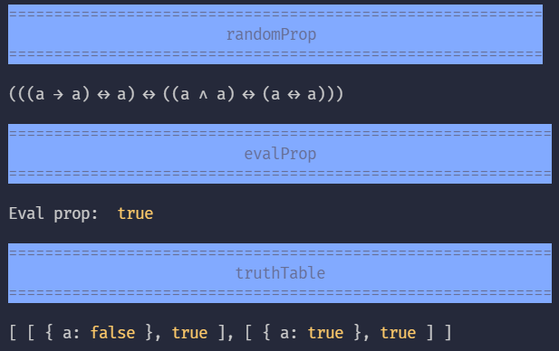
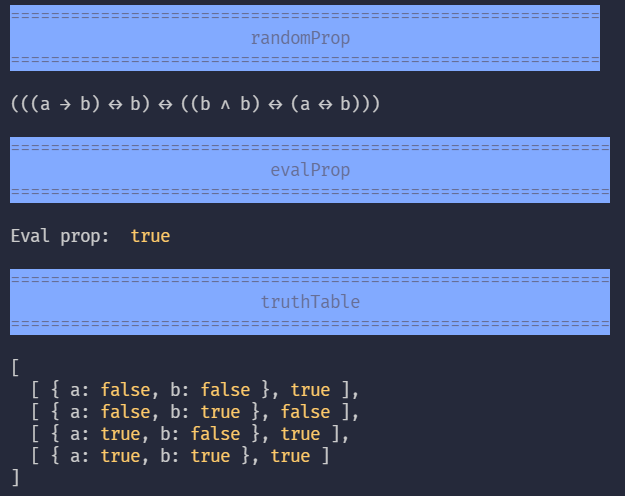
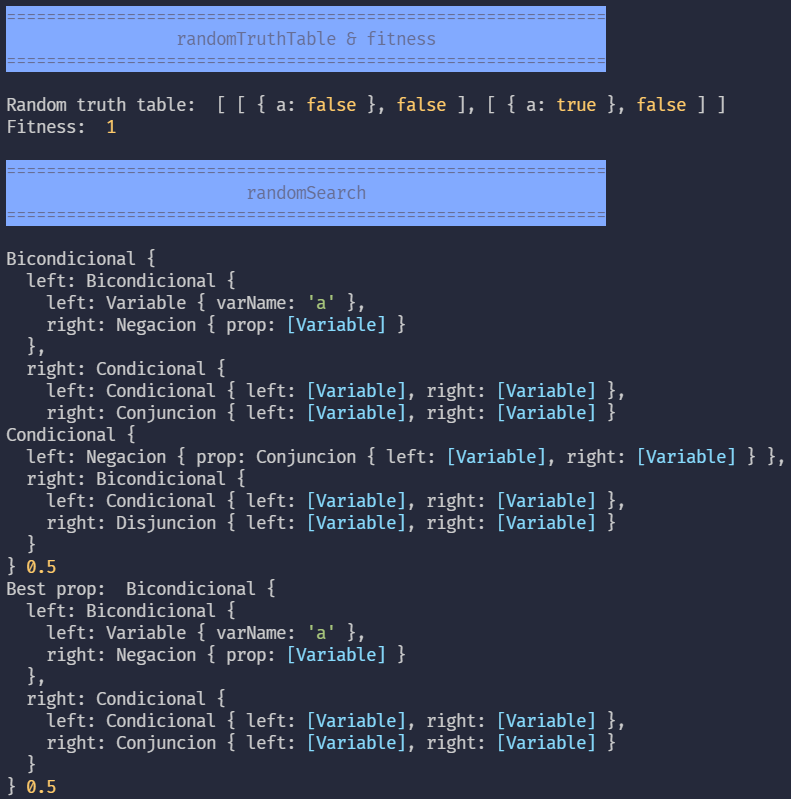
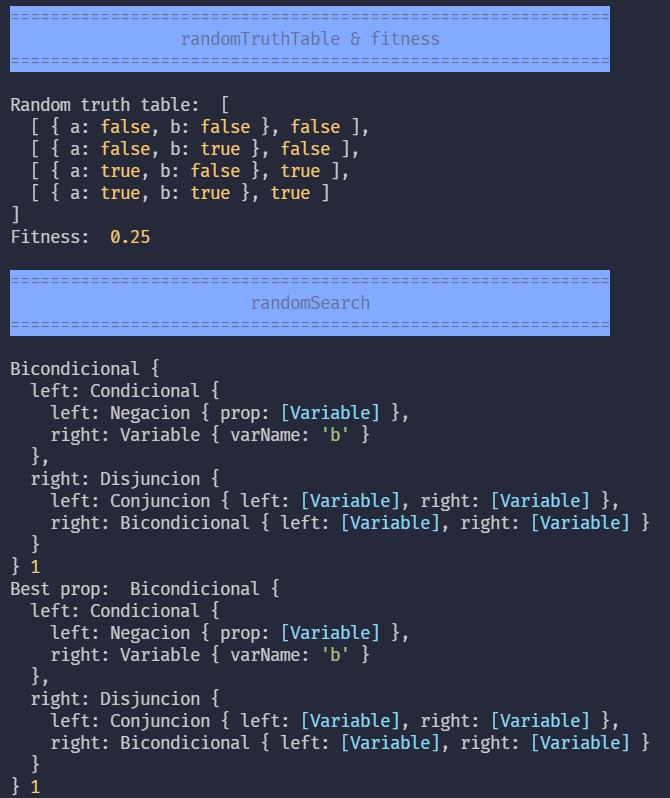

# Trabajo obligatorio - Lenguajes de programación

El proyecto consiste en la aplicación de la programación automática, la cual consiste en sintetizar automáticamente un programa a partir de una especificación. 
Para este trabajo, se trabajará en base a una tabla de verdad dada, para así obtener una expresión de cálculo proposicional.


## Estructura del proyecto
El proyecto se encuentra separado en scripts de acuerdo a la fase, o a su utilidad.

| Script   | Descripción                                                                                 |
|----------|---------------------------------------------------------------------------------------------|
| main.js  | Archivo a ejecutar para visualizar programa.                                                |
| utils.js | Métodos que sirven para un propósito compartido.                                            |
| prop.js  | Estructura de datos a utilizar a lo largo del proyecto.                                     |
| fase0.js | Métodos de la fase 0.                                                                       |
| fase1.js | Métodos de la fase 1.                                                                       |
| fase2.js | Métodos de la fase 2.                                                                       |

## Notas del proyecto
* El lenguaje elegido fue [JavaScript](https://nodejs.org/es/download/), en su última versión. 
* Fue necesario utilizar algunas bibliotecas, por lo que se recomienda antes de iniciar el programa, ejecutar el comando `npm install`. 

## Notas de las pruebas
* Las pruebas mostradas en las siguientes secciones se realizaron con una y dos variables. 
* Las pruebas se realizan de manera unitaria (por fase) y en conjunto. 
* En la sección Extra se encuentra la realización en conjunto de todos los métodos con tres variables. 
* Una fase depende de la otra, por lo que al momento de realizar estas pruebas se utilizan las variables definidas con anterioridad para otra fase.
---

<div style="page-break-after: always;"></div>

## Fase 0
La fase 0 consiste generar una proposición en base a un conjunto de variables definidas, evaluar dicha proposición y generar una tabla de verdad de la proposición.

Para obtener dichas proposiciones fue necesario contar con un generador de números aleatorios, pero en comparación con el comúnmente conocido, este devuelve siempre el mismo conjunto de resultados, lo que se denomina como semilla. 

##### Una variable
```js
var rng = prng_alea("LENG.PROG");

var vars = ['a'];
var maxHeight = 4;
var minHeight = 2;

printHeader("randomProp")
let propAleatoria = randomProp(rng, vars, maxHeight, minHeight);
console.log(propAleatoria.toString());

printHeader("evalProp");
console.log("Evaluación de proposición: ", evalProp(propAleatoria, {'a': true}))

printHeader("truthTable");
console.log(truthTable(propAleatoria, vars));
```

###### Resultado de ejecución con una variable


---
##### Dos variables
```js
var rng = prng_alea("LENG.PROG");

var vars = ['a', 'b'];
var maxHeight = 4;
var minHeight = 2;

printHeader("randomProp ")
let propAleatoria = randomProp(rng, vars, maxHeight, minHeight);
console.log(propAleatoria.toString());

printHeader("evalProp");
console.log("Eval prop: ", evalProp(propAleatoria, {'a': true, 'b': false}))

printHeader("truthTable");
console.log(truthTable(propAleatoria, vars));
```

###### Resultado de ejecución con dos variables


<div style="page-break-after: always;"></div>

## Fase 1
Para esta segunda fase se busca obtener expresiones aleatorias que se asemejen a una tabla de la verdad dada. Esto se realiza mediante la búsqueda aleatoria. 

##### Una variable
```js
var vars = ['a'];
var maxHeight = 4;
var minHeight = 2;

printHeader("randomTruthTable & fitness");
let randomTable = randomTruthTable(rng, vars);
console.log("Random truth table: ", randomTable);
console.log("Fitness: ", fitness(arbol, randomTable));

printHeader("randomSearch");
let bestRandomProp = randomSearch(rng, randomTable, 5, {vars, maxHeight, minHeight});
console.log("Best prop: ", bestRandomProp, fitness(bestRandomProp, randomTable));
```

###### Resultado de ejecución con una variable


##### Dos variables
```js
var vars = ['a', 'b'];
var maxHeight = 4;
var minHeight = 2;

printHeader("randomTruthTable & fitness");
let randomTable = randomTruthTable(rng, vars);
console.log("Random truth table: ", randomTable);
console.log("Fitness: ", fitness(arbol, randomTable));

printHeader("randomSearch");
let bestRandomProp = randomSearch(rng, randomTable, 5, {vars, maxHeight, minHeight});
console.log("Best prop: ", bestRandomProp, fitness(bestRandomProp, randomTable));
```

###### Resultado de ejecución con dos variables


<div style="page-break-after: always;"></div>

## Fase 2

